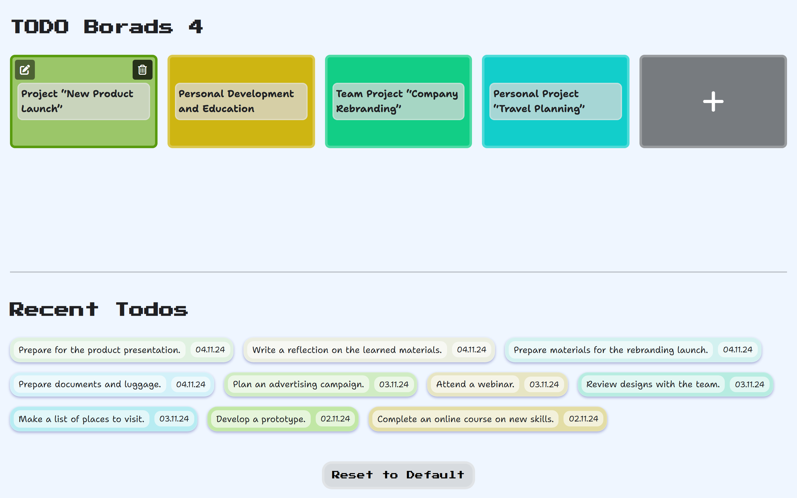

# Boardly

Boardly is a user-friendly, minimalist platform built as a frontend application using vanilla React from scratch, without the help of external libraries. 
This project showcases my ability to create a React application from the ground up.

## Application Overview
Boardly allows you to create customizable boards where you can:
- Change the color of the boards
- Move boards around using drag and drop
- Name the boards as you wish
- Create task lists within the boards
- Change the order of tasks within the boards

The boards and tasks are designed with various color tones to enhance usability and avoid confusion.

## Features
- **Customizable Boards**: Change colors and move boards with drag and drop.
- **Task Management**: Create, name, and reorder tasks within each board.
- **Activity Log**: View your recent activities on the main page, sorted by timestamp.
- **Local Storage**: All data is saved locally, and you can reset to default settings if needed.
- **Reset Function**: Easily reset the application to default settings with a confirmation.

## Future Plans
In the future, I plan to rewrite this application to make it more professional and add more features, such as:
- **Drag and Drop JSON File**: Load saved data from a JSON file.
- **Download JSON File**: Save the current state to a JSON file for offline storage and later viewing in Boardly.

## Technologies Used
- **Frontend**: React (vanilla, no external libraries)
- **State Management**: Local Storage
- **Styling**: Custom CSS

## License
This project is open source and available under the [MIT License](./LICENSE).

## Live Demo
Check out the live demo of Boardly [here](https://boardly.netlify.app).

---

Enjoy using Boardly!
